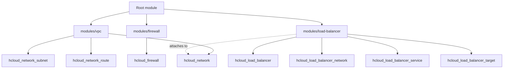

# Architecture

This module provides a composable way to create a Hetzner Cloud network (VPC), optional firewall rules, and an optional load balancer, wired together with sane defaults.

## High-level design

- **Root module (`../../`)**: Orchestrates the submodules and exposes consistent outputs.
- **`modules/vpc`**: Creates the `hcloud_network` plus optional subnets and routes.
- **`modules/firewall`**: Creates an `hcloud_firewall` with inbound/outbound rules.
- **`modules/load-balancer`**: Creates an `hcloud_load_balancer`, optional network attachment, services, and targets.

## Mermaid diagram

